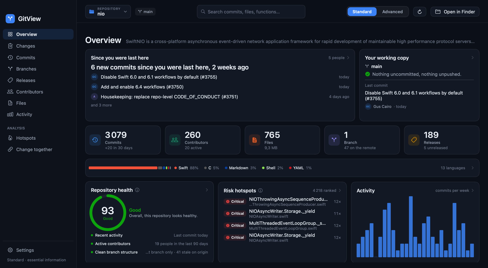

<div align="center">

# GitView

**Understand any repository. Faster.**

A native macOS app that reads a project's git history and tells you what changed,
who to ask about it, and which code is most likely to bite you.




</div>

## What it is

Open a repository and GitView answers the questions you actually have about it.

**What happened while I was away?** It remembers when you last looked and shows you what
landed since — whose commits, which files, and which of them touched code you have worked
on yourself.

**What have I got going on right now?** Uncommitted edits, staged changes, unpushed
commits, stashes, an interrupted rebase. You can stage, commit, stash and push from here.

**Who do I ask about this file?** Ownership per file and per folder, with the knowledge
risk when only one person has ever touched something.

**What changed between these two versions?** Any two tags, branches or commits, with
release notes you can copy into a changelog.

**Where is this project likely to break?** Functions ranked by how complicated they are
*and* how often they change — the combination, not either alone. Plus the functions that
keep being edited in the same commit as each other, which is where a change in one and a
forgotten change in the other turns into a bug.

It works on any git repository on your disk. Nothing is uploaded, there is no account, and
there is no telemetry; the only thing that touches the network is a push you asked for.

## Install

No release binary yet — build it from source. You need a Swift 6 toolchain (Xcode 16 or
newer; built and tested here on Swift 6.2).

```bash
git clone git@github.com:ShortPlanet3058/gitview.git
cd gitview
Scripts/make-app.sh --universal
cp -r build/GitView.app /Applications/
```

`--universal` builds for Apple Silicon and Intel; drop it to build only for this machine
and halve the build time. The first build compiles fifteen tree-sitter grammars and takes
a few minutes.

## Around the app

| | |
|---|---|
| **Overview** | The whole repository on one screen. Every tile opens the tab behind it. |
| **Changes** | Your working copy: stage, unstage, commit, stash, discard, push. |
| **Commits** | The history, grouped by day, filterable by author and message. |
| **Branches** | What exists, how far ahead or behind, and what is stale. |
| **Releases** | Tags, what is unreleased, and a diff between any two points. |
| **Contributors** | Who works here, on what, and when they were last seen. |
| **Files** | The tree with size, language breakdown, and per-file history and blame. |
| **Activity** | Commits over time, and the files that change most. |
| **Hotspots** | Functions ranked by risk, with the reasoning shown. |
| **Change together** | Functions that keep being edited in the same commits. |

Everything has two levels: **Standard** explains itself in plain language, **Advanced**
(⌘⇧D) adds every metric, the model parameters and a Statistics tab showing exactly how the
analysis was produced — including where it is imprecise.

## How it works

**Git is read by running git.** Every fact comes from `git` itself through `Process` —
`log`, `status`, `blame`, `rev-list`, `grep` — rather than a reimplementation of the object
format. If git says it, GitView says it.

**Code is parsed with tree-sitter.** Fifteen languages get function-level analysis: C, C#,
C++, CSS, Go, Java, JavaScript, Kotlin, PHP, Python, Ruby, Rust, Swift, TypeScript and TSX.
Every other language is still counted, sized and attributed — it just is not ranked by
function.

**Risk is complexity × recent change.** A function's branch points multiplied by a
time-decayed count of the commits that touched it, with a 365-day half-life. Both sides are
log-damped so one enormous switch statement cannot dominate the ranking. The half-life is a
measured default, not a guess: at the 90 days originally planned, most functions had at most
two commits in the window and the ranking correlated with nothing.

**Analyses are cached and extended.** A repository is read once; afterwards only the new
commits are, and the parse is skipped entirely when nothing has been edited. Re-opening a
large repository goes from tens of seconds to a fraction of one. If history is rewritten,
the cache is discarded rather than silently believed.

**It notices when the repository moves.** A watch on `.git` picks up a commit made in a
terminal, a pull, or a checkout, and brings the view up to date — unless you are reading a
diff or a file's history, in which case it offers rather than interrupts.

## Writing

GitView can stage, unstage, commit, stash, discard and push. The rule it follows is whether
an operation can be taken back:

- **Reversible** things — stage, unstage, stash, commit — are plain buttons.
- **Destructive** things — discarding edits, deleting an untracked file, dropping a stash —
  require a confirmation that says what will be lost, and offer to stash instead where that
  makes sense.
- **Push** shows you exactly what will go where before it does anything.

`push --force`, `reset --hard` and amending are deliberately absent. Each can destroy work
that exists nowhere else, and none is needed often enough to be worth having within reach
of a tired hand. A half-finished merge or rebase is reported, not driven — finish those in a
terminal.

## Development

```bash
swift build            # build
swift test             # 312 tests
Scripts/make-app.sh    # assemble GitView.app
Scripts/make-icon.swift # regenerate the app icon
```

The package is four targets: `GitViewCore` (models and analysis, no UI), `GitViewGit` (git
plumbing and output parsers), `GitViewParse` (tree-sitter), and `GitView` (the app). The
tests cover the parsers and the analysis; they run against real repositories created in
temporary directories, because a git command is only worth testing by what the repository
looks like afterwards.

Screens can be rendered offscreen for review without taking over your display:

```bash
build/GitView.app/Contents/MacOS/GitView --repo <path> --screen overview \
  --mode standard --screenshot out.png --screenshot-delay 15 --quit
```

## Known limits

- **macOS only**, and macOS 13 or newer.
- **Line ranges come from today's checkout** while a commit's hunks refer to the file as it
  was then, so old commits can be attributed to the wrong function. The Statistics tab
  measures this rather than hiding it: roughly 88–100% correct for commits under two years
  old, falling to about 42% beyond five years.
- **The health score is a heuristic** meant to start a conversation, not a verdict. Every
  check shows the number behind it.
- **Merge commits are not counted** by default, deliberately: counting them double-counts
  every change that arrived through one.
